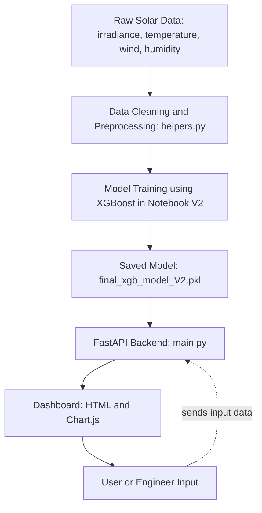

# ☀️ Solar Power Predictor AI — When the Sun Meets Intelligence

---

## 🌅 A New Dawn in Solar Intelligence

It started with silence — the kind you only find in the middle of a solar farm at sunrise.
Thousands of panels stretched toward the horizon, waiting for the first ray of light.

Beside them stood an engineer, notebook in hand, watching numbers on his monitor jump unpredictably.
Yesterday the plant produced 280 kW, today only 240 — same weather, same system, yet something unseen had changed.

He wasn’t guessing anymore.
He opened a small dashboard powered by **Solar Power Predictor AI**, entered a few weather readings, and watched the curve form instantly: a precise prediction of today’s generation — smooth, confident, data-backed.

For the first time, sunlight wasn’t just bright — it was **predictable**.

---

<p align="center">
  
</p>

---

## 💡 What Is Solar Power Predictor AI?

**Solar Power Predictor AI** is a machine learning–based system that predicts solar power generation using real-time environmental and irradiance data.
It combines **FastAPI**, **XGBoost**, and a **modern interactive dashboard** to empower engineers and researchers with insights that go beyond monitoring — toward *true understanding*.

---

---

## 🚀 Highlights

* ⚙️ **FastAPI-powered backend** for clean RESTful predictions
* ⚡ **High-accuracy model (XGBoost)** fine-tuned for solar data
* 🌦️ **Handles real-world variance** — dust, temperature, humidity
* 🧹 **Smart preprocessing**: physical limits + outlier removal
* 📈 **Dynamic dashboard** for real-time visualization
* 🇸🇦 Optimized for **Saudi Arabian irradiance patterns**
* 🔍 Built-in **feature importance and seasonal analysis**

---

## 📂 Repository Structure

```
.
├── helpers.py                         # Core ML utilities (cleaning, training, evaluation)
│
├── Notebooks/
│   ├── solar_power_prediction.ipynb
│   └── solar_power_prediction-V2.ipynb   # ✅ Main modeling notebook (V2)
│
└── solar_api/
    └── app/
        ├── main.py                    # FastAPI main server
        ├── preprocessing.py           # API-side data cleaning
        ├── static/                    # Front-end dashboard (HTML + Chart.js)
        │   └── index.html
        └── models/
            └── final_xgb_model_V2.pkl # Trained XGBoost model (V2)
```

---

## ⚙️ Installation

### 1️⃣ Install dependencies

```bash
pip install -r requirements.txt
```

### 2️⃣ Run the backend

```bash
uvicorn app.main:app --reload
```

Then open:
👉 [http://127.0.0.1:8000](http://127.0.0.1:8000)

---

## 🖥️ Solar Dashboard

<p align="center">
  
</p>

### Features

* Manual input for weather parameters
* Real-time power prediction visualization
* Chart.js graphs for clarity and aesthetics
* Smooth API integration with FastAPI backend

---

## 🧩 API Endpoints

### 🔹 `/predict/manual/`

Manual entry of weather data for prediction.

```json
{
  "Geff_Reference_Wm2": 882.6824951,
  "Geff_Test_Wm2": 862.0757446,
  "Module_Surface_Temperature2_degC": 60.11365128,
  "Module_Surface_Temperature1_degC": 60.98873138,
  "Temperature_Reference_Cell_degC": 65.78366089,
  "Temperature_Test_degC": 67.51657104,
  "Soiling_Loss_Index_Isc_percent": 0.381820202,
  "Soiling_Loss_Index_Geff_percent": 0.361185163,
  "Ambient_Temp_degC": 40.22800064
}
```

### 🔹 `/predict/by_time/`

Predict based on a specific timestamp.

```json
{
  "timestamp": "2025-01-01 08:00:00"
}
```

---

## 📊 Model Comparison

<p align="center">
  
</p>

<div align="center">

| Model         | Train RMSE | Test RMSE  | Δ Overfit  | R² (Test) |
| ------------- | ---------- | ---------- | ---------- | --------- |
| **XGBoost**   | **14,311** | **21,418** | **+7,106** | **0.964** |
| Ridge (Poly1) | 30,389     | 32,340     | +1,951     | 0.932     |
| Ridge (Poly2) | 23,091     | 53,566     | +30,475    | 0.649     |

</div>

🧠 **XGBoost** offered the best generalization, with balanced bias–variance tradeoff.  
Polynomial models, while fitting training data, failed to scale seasonally — suffering from high overfitting.

---

## 🌤️ Seasonal Evaluation

<div align="center">

| Season     | Best Model    | RMSE%     | R²    | Observation                  |
| ---------- | ------------- | --------- | ----- | ---------------------------- |
| **Winter** | XGBoost       | **32.5%** | 0.948 | Great under weak irradiance  |
| **Spring** | Ridge (Poly1) | 47.6%     | 0.833 | Unstable sunlight transition |
| **Summer** | XGBoost       | **9.8%**  | 0.991 | Peak performance             |
| **Fall**   | XGBoost       | **14.0%** | 0.988 | Consistent predictions       |

</div>

---

### 📊 Model Performance on Training Data

<p align="center">
  
</p>

🔹 This plot shows how well the predicted values align with the actual ones on the **training dataset**,  
demonstrating how accurately the model learned the underlying relationships.

---

### 🧪 Model Performance on Test Data

<p align="center">
  
</p>

🔹 A similar plot, but this time on the **test dataset**, used to evaluate the model’s ability to generalize  
to unseen data beyond the training phase.

---

### 📋 Actual vs Predicted Comparison Table

<p align="center">
  
</p>

🔹 This chart shows a **side-by-side comparison** between real and predicted outputs,  
highlighting how closely the model’s estimates match the actual power generation values.

---

## 🔬 Train vs Test Performance Comparison

<p align="center">
  
</p>

<div align="center">
  
| Dataset         | RMSE (W)      | R²        |
| --------------- | ------------- | --------- |
| 🟢 **Training** | **13,435.06** | **0.989** |
| 🔵 **Test**     | **19,433.48** | **0.977** |

The **train–test alignment** demonstrates strong generalization:
XGBoost learned the solar generation patterns effectively while maintaining robustness on unseen data.
Residuals are minimal and physically reasonable — a hallmark of a stable, production-ready model.

</div>

---

### 💡 Feature Importance (XGBoost)

<p align="center">
  
</p>

🔹 This plot displays the **key features** XGBoost relied on most to make predictions —  
such as solar irradiance and module temperature — helping explain the model’s decision-making process.


---

## 🧮 Final Evaluation

| Dataset           | RMSE (W)   | R²        | RMSE % of Capacity |
| ----------------- | ---------- | --------- | ------------------ |
| **Training**      | 13,435     | 0.989     | —                  |
| **External Test** | **19,433** | **0.977** | **6.45%**          |

📊 **System capacity:** ≈ 301,505 W
✅ **Error margin:** only 6.45%

Reliable, stable, and ready for deployment.

---

## 🧰 Tech Stack

| Layer               | Technology                    |
| ------------------- | ----------------------------- |
| **Backend**         | FastAPI, Uvicorn              |
| **ML Engine**       | XGBoost, Scikit-Learn         |
| **Data Handling**   | Pandas, NumPy                 |
| **Visualization**   | Matplotlib, Seaborn, Chart.js |
| **Frontend**        | HTML, JavaScript              |
| **Environment**     | Python 3.11+                  |
| **Version Control** | Git + GitHub                  |

---

## 🌎 Real-World Use

* Helps solar engineers predict output confidently
* Supports energy scheduling and storage decisions
* Enables grid balancing and sustainability forecasting
* Tuned for **Middle Eastern climates and conditions**

---
<section id="team">     <h2>Team Member</h2>     <p>Ashutosh Ranjan</p>
<p>Aryan Yadav</p>
<p>Divyansh Sharma</p>
<p>Tusha</p>
<p>Manali</p>
<p>Sakshi</p>

---
